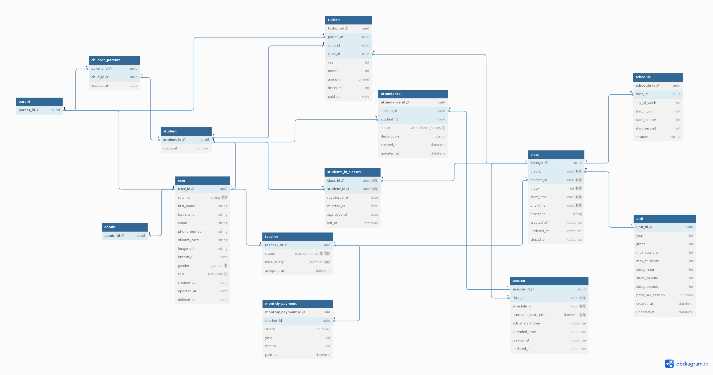

# About project

This is a [Next.js](https://nextjs.org/) project bootstrapped with [`create-next-app`](https://github.com/vercel/next.js/tree/canary/packages/create-next-app).

# Table of content

[prerequisites](#-prerequisites)<br>
[setup](#-setup)<br>
[getting started](#-getting-started)<br>
[run test (comming soon)](#-run-test)<br>
[database schema](#-database-schema)<br>
[learn more](#-learn-more)<br>
[deployment (comming soon)](#-deploy-on-vercel)<br>

## ⇁ Prerequisites

you must have npm installed<br>
you also need [clerk](https://clerk.com/) account, a domain<br>
database of your choice

## ⇁ Setup

first, clone this project<br>
install packages:

```shell
npm install
```

you need to have `.env` file in root project, in the file you need `key=value` each line. See list of required environment variables [here](#-list-of-available-environment-variables):<br>

sign in your clerk account, create a new app, then in `Configure`, choose `Sessions > Customize session token > Edit` clerk's session token, add:

```json
{
	"metadata": {
		"public": "{{user.public_metadata}}",
		"unsafe": "{{user.unsafe_metadata}}"
	}
}
```

after that, in `Configure`, choose `Webhooks > Endpoints > Add Endpoint`. Inside `Endpoint URL`, add `[protocol]://[domain]/api/webhooks/clerk` with protocol and domain have the same value as environment variables you set in `.env`. In `Subscribe to events` session, select `user.created`, `user.updated`, `user.deleted` then press `Create` to create a new webhook, then add webhook secret key to `.env` file<br>

to update your database schema, first, start your database, then run this command:

```bash
npx prisma db push
```

please make sure that you already have `DATABASE_URL` that matches your database in `env`

## ⇁ List of available environment variables

| Variable                                        | Required | Purpose                                                                                                                                                                                                                                       |
| ----------------------------------------------- | -------- | --------------------------------------------------------------------------------------------------------------------------------------------------------------------------------------------------------------------------------------------- |
| NEXT_PUBLIC_NODE_ENV                            | YES      | set runtime environment, can be "development" or "production"                                                                                                                                                                                 |
| NEXT_PUBLIC_REACT_EDITOR                        | NO       | choose editor                                                                                                                                                                                                                                 |
| NEXT_PUBLIC_DOMAIN                              | YES      | set app domain name                                                                                                                                                                                                                           |
| NEXT_PUBLIC_PROTOCOL                            | YES      | set protocol, can be "http" or "https"                                                                                                                                                                                                        |
| NEXT_PUBLIC_CLERK_SIGN_IN_URL                   | NO       | Full URL or path to the sign in page. Use this variable to provide the target of the 'Sign In' link that's rendered in the `<SignUp />` component. Should be set to `/sign-in`                                                                |
| NEXT_PUBLIC_CLERK_SIGN_UP_URL                   | NO       | Full URL or path to the sign up page. Use this variable to provide the target of the 'Sign Up' link that's rendered in the `<SignIp />` component. Should be set to `/sign-up`                                                                |
| NEXT_PUBLIC_CLERK_SIGN_IN_FALLBACK_REDIRECT_URL | NO       | The fallback URL to redirect to after the user signs in, if there's no `redirect_url` in the path already. Defaults to `/`                                                                                                                    |
| NEXT_PUBLIC_CLERK_SIGN_UP_FALLBACK_REDIRECT_URL | NO       | The fallback URL to redirect to after the user signs up, if there's no `redirect_url` in the path already. Defaults to `/`                                                                                                                    |
| NEXT_PUBLIC_CLERK_PUBLISHABLE_KEY               | YES      | clerk public key. Sign in to clerk, in `Developers` session, choose `API keys` and copy the value in `Publishable key`                                                                                                                        |
| CLERK_SECRET_KEY                                | YES      | clerk secret key. Sign in to clerk, in `Developers` session, choose `API keys` and copy the value in `Secret keys`. PLEASE DO NOT public this value                                                                                           |
| WEBHOOK_SECRET                                  | YES      | clerk webhook key for webhook connection. Sign in to clerk,in `Configure`, choose `Webhooks > Endpoints`, select your endpoint (or create new one if you don't have any), copy the value in `Signing Secret`. PLEASE DO NOT public this value |
| DATABASE_URL                                    | YES      | for prisma connection with database                                                                                                                                                                                                           |

## ⇁ Getting Started

First, run the development server:

```bash
npm run dev
# or
yarn dev
# or
pnpm dev
# or
bun dev
```

Open `[protocol]://[domain]:3000` with your browser to see the result.

This project uses [`next/font`](https://nextjs.org/docs/basic-features/font-optimization) to automatically optimize and load Inter, a custom Google Font.

## ⇁ Run test

Run the end-to-end tests

```bash
npx playwright test
```

Start the interactive UI mode

```bash
npx playwright test --ui
```

Run the test only on Desktop Chrome

```bash
npx playwright test --project=chromium
```

Run the tests in a specific file

```bash
npx playwright test example
```

Run the tests in debug mode

```bash
npx playwright test --debug
```

Auto generate tests with Codegen

```bash
npx playwright codegen
```

We suggest that you begin by typing:

```bash
npx playwright test
```

## ⇁ Database schema



## ⇁ Learn more

To learn more about Next.js, take a look at the following resources:

-   [Next.js Documentation](https://nextjs.org/docs) - learn about Next.js features and API.
-   [Learn Next.js](https://nextjs.org/learn) - an interactive Next.js tutorial.

You can check out [the Next.js GitHub repository](https://github.com/vercel/next.js/) - your feedback and contributions are welcome!

## ⇁ Deploy on Vercel

The easiest way to deploy your Next.js app is to use the [Vercel Platform](https://vercel.com/new?utm_medium=default-template&filter=next.js&utm_source=create-next-app&utm_campaign=create-next-app-readme) from the creators of Next.js.

Check out our [Next.js deployment documentation](https://nextjs.org/docs/deployment) for more details.
